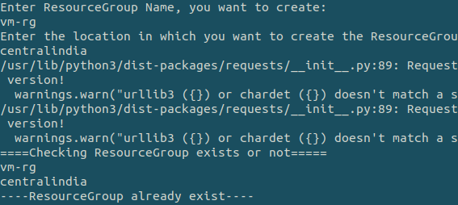
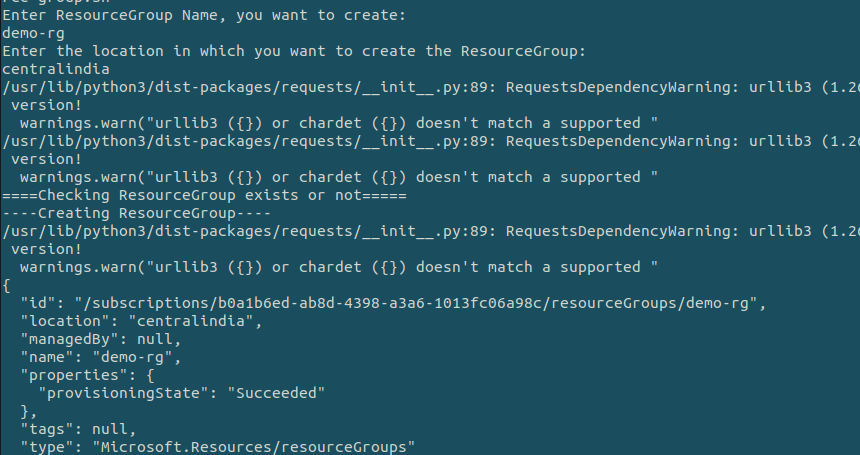
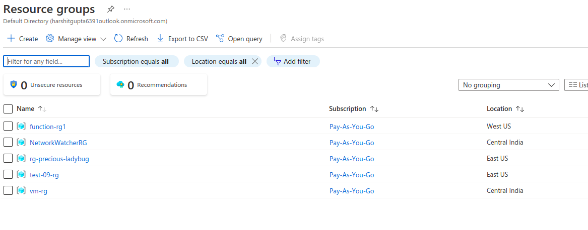

## Description

Here, In this template we will create the Resource Group of Azure using the shell script.

---

#### Pre-requisite

* AZ Account
* Azure CLI

---
#### Note
While creating the resource group and running the script you will get all the available locations in `locations.txt` which will be present only at the time of running the script.

---

### Steps:-
1. Login into AZ account using `az login` or `az login --tenant <TENANT-ID>`
2. Change the permission of the file `chmod a+x change-vm-state.sh`
3. Go to the terminal and run the command `./create-resource-group.sh`

---

### Outputs
* Here, In this output it's showing the Resource group already exist :

* Here, In this output we are creating new resource group :

* Before creating the resource group on Azure Cloud:

* After creating the resource group on Azure Cloud:

---
